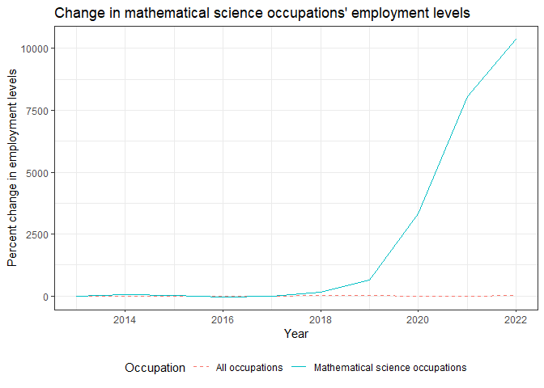
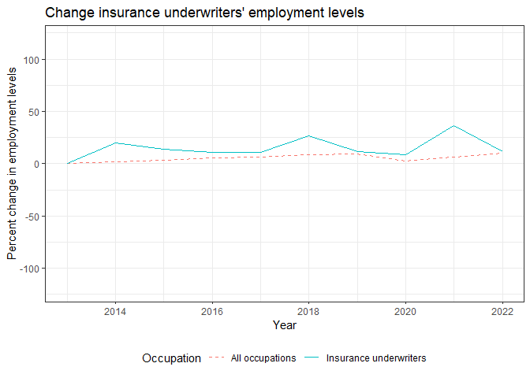
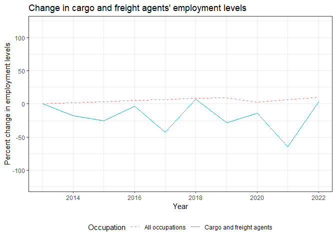
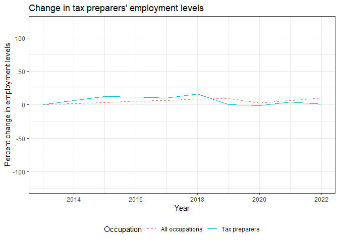
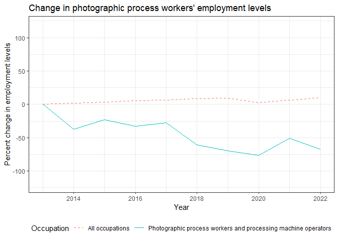

The following graphs use BLS data to show how much a given occupation's employment has changed over the past decade or so. Each graph displays the percent change in an occupation's employment levels relative to the first year the graph begins. It also compares this change to the overall change in employment across all occupations in the U.S.

## Telemarketers

## Title examiners, abstractors, and searchers

## Sewers, hand

## Mathematical science occupations

## Insurance underwiters

## Watch repairers

## Cargo and freight agents

## Tax preparers

## Photographic process workers and processing machine operators

## New account clerks

