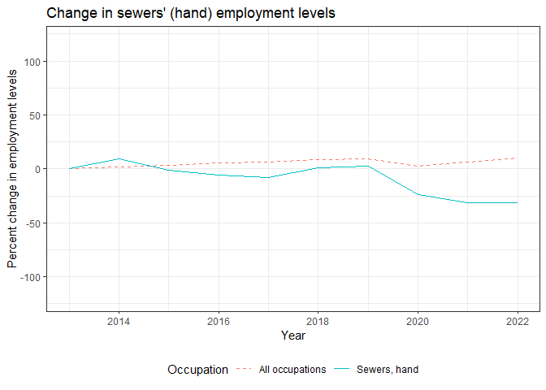

The following graphs use BLS data to show how much a given occupation's employment has changed over the past decade or so. Each graph displays the percent change in an occupation's employment levels relative to the first year the graph begins. It also compares this change to the overall change in employment across all occupations in the U.S.

## Recreational therapists

## First-line supervisors of mechanics, installers, and repairers

## Emergency management directors

## Mental health and substance abuse social workers

## Audiologists

## Occupational therapists

## Orthotists and prosthetists

## Healthcare social workers

## Oral and maxillofacial surgeons

## First-line supervisors of fire fighting and prevention workers

